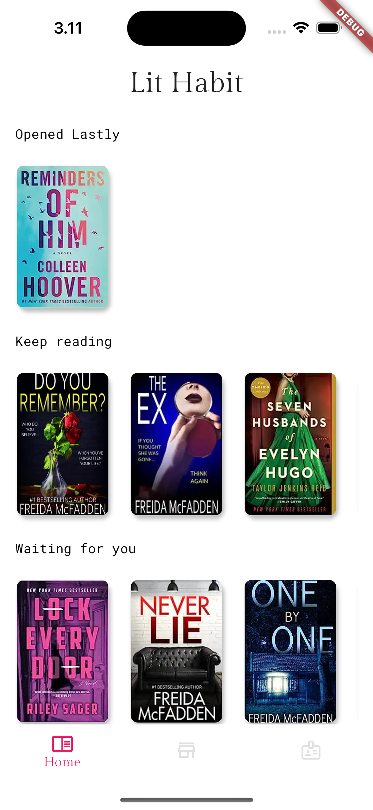
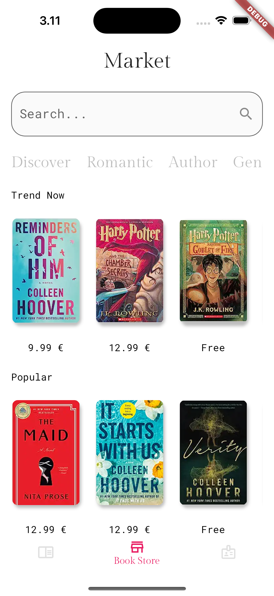
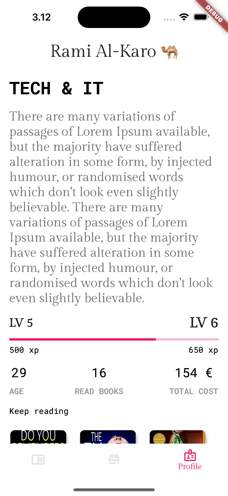

# Lit Habit Ebook Library Mobile App

Lit Habit is a mobile app that allows users to access and read a wide collection of ebooks on their smartphones or tablets. The app provides a user-friendly interface and a range of features to enhance the reading experience. Users can discover new books, manage their library, customize reading preferences, and more.

Youtube Video Link: [https://youtu.be/3bvUSIxfBsk](https://youtu.be/3bvUSIxfBsk)

## Features

- **Book Discovery**: Explore a vast collection of ebooks across various genres and categories. Discover new releases, bestsellers, and personalized recommendations based on your reading preferences.

- **Library Management**: Create a personal library to organize your ebooks. Add books to your library, categorize them, and mark favorites for quick access. Keep track of your reading progress and bookmark important pages.

- **Customizable Reading Experience**: Customize the reading interface to suit your preferences. Adjust font size, choose different reading themes, and control brightness for comfortable reading in different lighting conditions.

- **Offline Reading**: Download ebooks to your device for offline reading. Access your favorite books even when you don't have an internet connection.

- **Search and Filters**: Easily search for specific books or authors. Use filters to narrow down your search results based on criteria such as genre, language, and publication date.

- **Reading Progress Sync**: Sync your reading progress across multiple devices. Start reading on one device and continue seamlessly on another without losing track of your progress.

## Screenshots

| Home Screen             | Book Details             | Library                  |
|-------------------------|--------------------------|--------------------------|
|  |  |  |

## Installation

1. Clone the repository: `git clone https://github.com/ramialkaro/lit-habit`
2. Install the dependencies: `cd lit-habit && flutter pub get`
3. Run the app: `flutter run`

## Feedback and Support

We value your feedback and suggestions to enhance the Lit Habit Ebook. If you encounter any issues or need assistance, please create a new issue on the GitHub repository.

## License

This project is licensed under the [MIT License](LICENSE).
